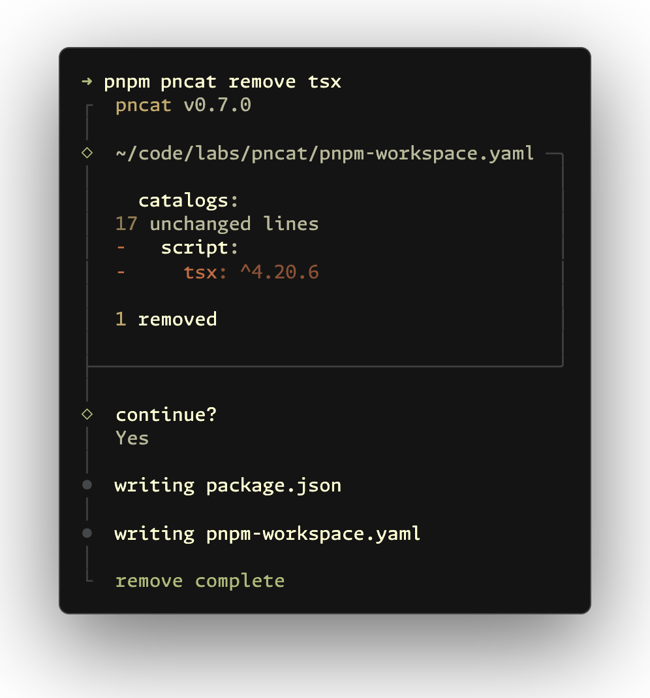
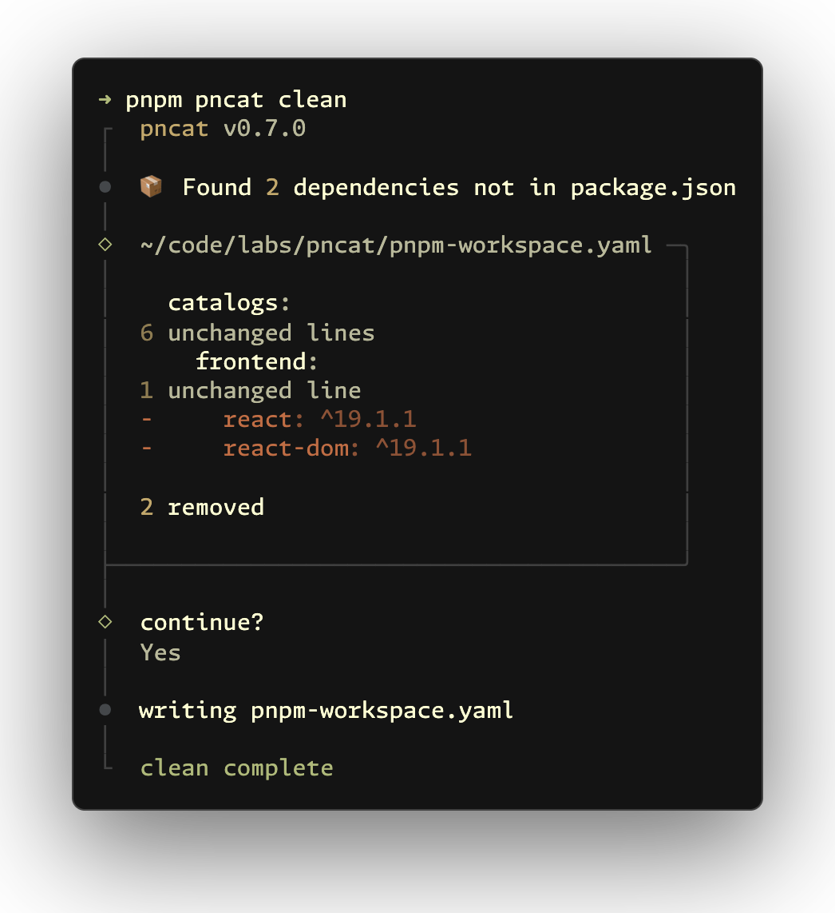

<h1 align="center">pncat</h1>

<p align="center">A unified cli tool that enhances package managers <code>catalog:</code> feature</p>

[![npm version][npm-version-src]][npm-version-href]
[![npm downloads][npm-downloads-src]][npm-downloads-href]
[![JSDocs][jsdocs-src]][jsdocs-href]
[![License][license-src]][license-href]

```sh
pnpm add -D pncat
```

<samp><b>[pnpm](https://pnpm.io/catalogs)</b></samp> · <samp><b>[yarn](https://yarnpkg.com/features/catalogs)</b></samp> · <samp><b>[bun](https://bun.sh/docs/install/catalogs)</b></samp> · <samp><b>[vlt](https://docs.vlt.sh/cli/catalogs)</b></samp>

- <samp><b>🚀 Init</b></samp> - Initialize config with optimized rules
- <samp><b>🔍 Detect</b></samp> - Scan workspaces for catalogable dependencies
- <samp><b>📦 Migrate</b></samp> - Group dependencies by rules automatically
- <samp><b>➕ Add</b></samp> - Install dependencies with catalog and workspace support
- <samp><b>➖ Remove</b></samp> - Remove dependencies safely from catalogs and packages
- <samp><b>🧹 Clean</b></samp> - Remove unused catalog entries
- <samp><b>↩️ Revert</b></samp> - Move cataloged dependencies back to `package.json`

<p align='center'>

</p>

## Usage

### Init

```sh
pncat init
pncat create
pncat setup
pncat config
pncat conf
```

Initializes your workspace with an optimized config file. It analyzes current workspace dependencies and generates tailored rules for clearer project structure.

<p align='center'>

</p>

### Detect

```sh
pncat detect
pncat d
pncat scan
pncat check
pncat find
```

Scans your workspace and lists dependencies that can be moved to catalogs.

<p align='center'>

</p>

### Migrate

```sh
pncat migrate
pncat mig
pncat move
pncat mv
pncat m
```

> [!NOTE]
> To refresh catalog groups by rules, run `pncat migrate -f`. For a clean migration, run `pncat revert` → `pncat migrate`.

Groups dependencies by rules (for example lint, test, utils) and updates both workspace catalog config and related `package.json` files.

Default rules are in `src/rules.ts`. To customize them, create `pncat.config.ts` in the project root.

<p align='center'>

</p>

### Add

```sh
pncat add dep
pncat install dep
pncat in dep
pncat i dep
```

Adds dependencies with interactive prompts and catalog support (credit to [@antfu/nip](https://github.com/antfu/nip)). Also supports adding monorepo workspace packages with the `workspace:` protocol.

Use `--catalog <name>` to target a catalog. If omitted, pncat assigns dependencies based on your catalog rules.

<p align='center'>

</p>

### Remove

```sh
pncat remove dep
pncat rm dep
pncat r dep
pncat uninstall dep
pncat un dep
pncat u dep
```

Shows which catalog group uses the dependency. After confirmation, removes it from both workspace catalog config and `package.json`.

To remove a dependency across the monorepo, use `pnpm remove dep -r` or `pnpm remove dep --recursive`.

<p align='center'>

</p>

### Clean

```sh
pncat clean
pncat cl
pncat c
pncat prune
```

Finds unused catalog dependencies and removes them from workspace catalog config.

<p align='center'>

</p>

### Revert

```sh
pncat revert
pncat rev
pncat restore
pncat undo
```

Moves cataloged dependencies back to `package.json`. Useful during monorepo restructuring or migration.

<p align='center'>

</p>

You can also revert specific dependencies:

```sh
pncat revert dep
pncat rev dep
pncat restore dep
pncat undo dep
```

<p align='center'>

</p>

## Configuration

Run `pncat init` to generate optimized rules from your current workspace, or create `pncat.config.ts` manually:

```ts
import { defineConfig, mergeCatalogRules } from 'pncat'

export default defineConfig({
  // To extend defaults instead: catalogRules: mergeCatalogRules([...])
  catalogRules: [
    {
      name: 'vue',
      match: ['vue', 'vue-router', 'pinia'],
      // Smaller number = higher priority
      priority: 15,
      // Advanced: version-specific rules
      specifierRules: [
        { specifier: '<3.0.0', suffix: 'legacy', match: ['vue'] }
      ]
    }
  ],
  // Controls version-range processing
  specifierOptions: {
    skipComplexRanges: true,
    allowPreReleases: true,
    allowWildcards: false,
    allowNpmAliases: true
  },
  // Save exact versions instead of semver operators
  saveExact: true,
  // Hook after command completion (string, function, or array)
  postRun: 'eslint --fix "**/package.json" "**/pnpm-workspace.yaml"'
})
```

<samp><b>Catalog Rules:</b></samp>
- `name`: Catalog name (required)
- `match`: Packages to include, supports RegExp (required)
- `priority`: Smaller number = higher priority (optional)
- `specifierRules`: Version-specific rules (optional)
  - `specifier`: Semver range like `>=3.0.0`, `<2.0.0` (required)
  - `match`: Packages this rule applies to (optional, defaults to parent match)
  - `name`: Full catalog name (takes priority over `suffix`)
  - `suffix`: Catalog suffix (for example `legacy`, `modern`)

<samp><b>Specifier Options (optional):</b></samp>
- `skipComplexRanges`: Skip complex ranges like `||`, `-`, `>=` (default: `true`)
- `skipRangeTypes`: Range types to skip (overrides `skipComplexRanges`)
  - `'||'`: Logical OR (for example `^3.0.0 || ^4.0.0`)
  - `'-'`: Hyphen range (for example `1.2.3 - 2.3.4`)
  - `'>='`, `'<='`, `'>'`, `'<'`: Comparison ranges
  - `'x'`: Wildcard (for example `3.x`)
  - `'*'`: Any version
  - `'pre-release'`: Beta/alpha/rc versions
- `allowPreReleases`: Allow beta/alpha/rc versions (default: `true`)
- `allowWildcards`: Allow wildcard versions like `3.x`, `*` (default: `false`)
- `allowNpmAliases`: Allow npm alias specifiers like `npm:@foo/bar@^1` (default: `true`)

## Why pncat?

In monorepos, keeping dependency versions consistent across packages is important. Grouping dependencies improves project readability and team collaboration.

pnpm catalog support is still limited. For example, it does not provide built-in flows to add or migrate dependencies into specific groups. Managing catalogs manually across a workspace is slow and error-prone, so pncat fills this gap.

When migrating packages in a catalog-based monorepo, you also need to maintain workspace catalog config and remove outdated catalog entries. `clean` and `revert` automate this part.

## Inspiration

This project is inspired by and builds on:

- [taze](https://github.com/antfu-collective/taze) - monorepo I/O utilities for reading and parsing workspace config and `package.json` files
- [@antfu/nip](https://github.com/antfu/nip) - interactive prompt and UX inspiration for dependency workflows

Special thanks to [@antfu](https://github.com/antfu) and his article [Categorizing Dependencies](https://antfu.me/posts/categorize-deps), which strongly influenced this tool.

## Related Projects

- [eslint-plugin-pnpm-catalog](https://github.com/onmax/eslint-plugin-pnpm-catalog) by [@onmax](https://github.com/onmax) - ESLint plugin to enforce named catalogs in pnpm workspaces

## Contributors

[](https://github.com/jinghaihan/pncat/graphs/contributors)

## License

[MIT](./LICENSE) License © [jinghaihan](https://github.com/jinghaihan)

<!-- Badges -->

[npm-version-src]: https://img.shields.io/npm/v/pncat?style=flat&colorA=080f12&colorB=1fa669
[npm-version-href]: https://npmjs.com/package/pncat
[npm-downloads-src]: https://img.shields.io/npm/dm/pncat?style=flat&colorA=080f12&colorB=1fa669
[npm-downloads-href]: https://npmjs.com/package/pncat
[bundle-src]: https://img.shields.io/bundlephobia/minzip/pncat?style=flat&colorA=080f12&colorB=1fa669&label=minzip
[bundle-href]: https://bundlephobia.com/result?p=pncat
[license-src]: https://img.shields.io/badge/license-MIT-blue.svg?style=flat&colorA=080f12&colorB=1fa669
[license-href]: https://github.com/jinghaihan/pncat/LICENSE
[jsdocs-src]: https://img.shields.io/badge/jsdocs-reference-080f12?style=flat&colorA=080f12&colorB=1fa669
[jsdocs-href]: https://www.jsdocs.io/package/pncat
