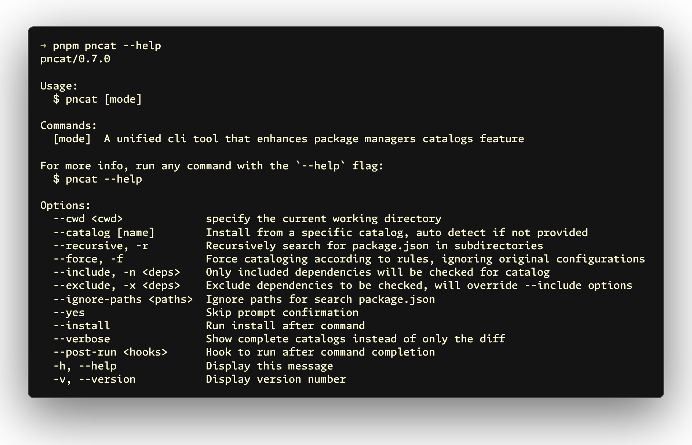
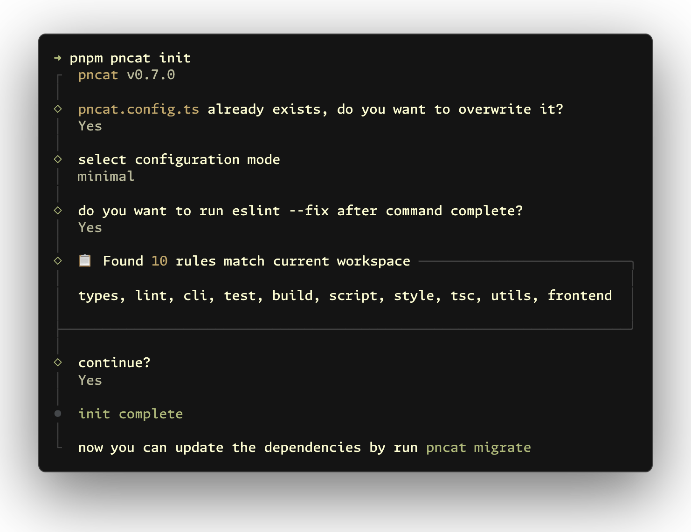
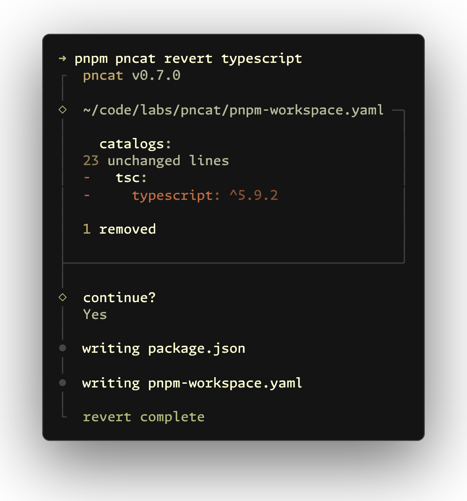

<h1 align="center"><samp><b>pncat</b></samp></h1>

<p align="center">A unified cli tool that enhances package managers <code>catalog:</code> feature</p>

[![npm version][npm-version-src]][npm-version-href]
[![npm downloads][npm-downloads-src]][npm-downloads-href]
[![JSDocs][jsdocs-src]][jsdocs-href]
[![License][license-src]][license-href]

```sh
pnpm add -D pncat
```

<samp><b>[pnpm](https://pnpm.io/catalogs)</b></samp> · <samp><b>[yarn](https://yarnpkg.com/features/catalogs)</b></samp> · <samp><b>[bun](https://bun.sh/docs/install/catalogs)</b></samp> · <samp><b>[vlt](https://docs.vlt.sh/cli/catalogs)</b></samp>

- <samp><b>🚀 Init</b></samp> - Initialize configuration with optimized rules
- <samp><b>🔍 Detect</b></samp> - Scan workspace to identify catalogable dependencies
- <samp><b>📦 Migrate</b></samp> - Automatically group dependencies by rules
- <samp><b>➕ Add</b></samp> - Install dependencies with catalog and workspace support
- <samp><b>➖ Remove</b></samp> - Safely remove dependencies and worksspace catalogs
- <samp><b>🧹 Clean</b></samp> - Find and remove unused catalog entries
- <samp><b>↩️ Revert</b></samp> - Revert cataloged dependencies to package.json

<p align='center'>

</p>

## Usage

### Init

```sh
pncat init
pncat create
pncat setup
pncat config
pncat conf
```

Initialize your workspace with an optimized configuration file. Analyzes your current workspace dependencies and generates tailored rules for better project visibility.

<p align='center'>

</p>

### Detect

```sh
pncat detect
pncat d
pncat scan
pncat check
pncat find
```

Scans your workspace to identify dependencies that could be moved to catalogs.

<p align='center'>

</p>

### Migrate

```sh
pncat migrate
pncat mig
pncat move
pncat mv
pncat m
```

> [!NOTE]
> To update catalog groups according to rules, run `pncat migrate -f`, or do a clean migration with `pncat revert` → `pncat migrate`.

Automatically groups dependencies by rules (e.g., lint, test, utils), updating both workspace catalog configuration and relevant `package.json`.

Default rules can be found in `src/rules.ts`. To customize rules, create a `pncat.config.ts` file in the root directory.

<p align='center'>

</p>

### Add

```sh
pncat add dep
pncat install dep
pncat in dep
pncat i dep
```

Add dependencies with prompts and catalogs support (credit to [@antfu/nip](https://github.com/antfu/nip)). It also supports adding monorepo workspace packages using the `workspace:` protocol.

You can specify a catalog name using `--catalog name`. When no catalog is specified, dependencies are automatically assigned based on your catalog rules configuration.

<p align='center'>

</p>

### Remove

```sh
pncat remove dep
pncat rm dep
pncat r dep
pncat uninstall dep
pncat un dep
pncat u dep
```

Display which catalog group is using the dependency. If confirmed, it will remove the dependency from both workspace catalog configuration and `package.json`.

To remove a dependency from all packages in the monorepo, you can use `pnpm remove dep -r` or `pnpm remove dep --recursive` to recursively remove the dependency from all workspace packages.

<p align='center'>

</p>

### Clean

```sh
pncat clean
pncat cl
pncat c
pncat prune
```

Find unused catalog dependencies and remove them from workspace catalog configuration.

<p align='center'>

</p>

### Revert

```sh
pncat revert
pncat rev
pncat restore
pncat undo
```

Reverts cataloged dependencies to `package.json`. Useful for monorepo restructuring or migration.

<p align='center'>

</p>

You can also revert specific dependencies using:

```sh
pncat revert dep
pncat rev dep
pncat restore dep
pncat undo dep
```

<p align='center'>

</p>

## Configuration

You can use `pncat init` to initialize a configuration file with optimized rules based on your current workspace, or create a `pncat.config.ts` file manually to customize catalog rules:

```ts
import { defineConfig, mergeCatalogRules } from 'pncat'

export default defineConfig({
  // To extend default rules instead, use: catalogRules: mergeCatalogRules([...])
  catalogRules: [
    {
      name: 'vue',
      match: ['vue', 'vue-router', 'pinia'],
      // smaller numbers represent higher priority
      priority: 15,
      // Advanced: version-specific rules
      specifierRules: [
        { specifier: '<3.0.0', suffix: 'legacy', match: ['vue'] }
      ]
    }
  ],
  // Control how version ranges are processed
  specifierOptions: {
    skipComplexRanges: true,
    allowPreReleases: true,
    allowWildcards: false
  },
  // Saved dependencies will be configured with an exact version rather than using semver range operator
  saveExact: true,
  // Hook to run after command completion (supports string commands, functions, or arrays)
  postRun: 'eslint --fix "**/package.json" "**/pnpm-workspace.yaml"'
})
```

<samp><b>Catalog Rules:</b></samp>
- `name`: catalog name (required)
- `match`: packages to include, supports RegExp (required)
- `priority`: smaller numbers represent higher priority (optional)
- `specifierRules`: version-specific rules (optional)
  - `specifier`: semver range like ">=3.0.0", "<2.0.0" (required)
  - `match`: specific packages this rule applies to (optional, defaults to parent match)
  - `name`: complete catalog name (takes priority over suffix)
  - `suffix`: catalog suffix (e.g., "legacy", "modern")

<samp><b>Specifier Options (optional):</b></samp>
- `skipComplexRanges`: Skip complex ranges like "||", "-", ">=" (default: true)
- `skipRangeTypes`: Specific range types to skip (overrides skipComplexRanges)
  - `'||'`: Logical OR (e.g., "^3.0.0 || ^4.0.0")
  - `'-'`: Hyphen range (e.g., "1.2.3 - 2.3.4")
  - `'>='`, `'<='`, `'>'`, `'<'`: Comparison ranges
  - `'x'`: Wildcard (e.g., "3.x")
  - `'*'`: Any version
  - `'pre-release'`: Beta/alpha/rc versions
- `allowPreReleases`: Allow beta/alpha/rc versions (default: true)
- `allowWildcards`: Allow wildcard versions like "3.x", "*" (default: false)

## Why pncat?

For monorepo repositories, maintaining consistent dependency versions across multiple packages is crucial. Grouping dependencies can significantly improve project understanding, making it easier to collaborate within teams or keep track of the project's structure.

Currently, pnpm's catalog support is limited. For example, there is no built-in feature for adding or migrating dependencies into specific groups. Managing the catalog manually across the entire project can be time-consuming and error-prone. To address this, pncat was developed.

Additionally, when migrating a specific package in a monorepo that uses catalogs, it's important to also migrate the workspace catalog configuration. This requires manually comparing which catalogs need to be removed. To streamline this process, the `clean` and `revert` commands were introduced to automate this task.

## Inspiration

This project is inspired by and builds upon the excellent work of the following projects:

- [taze](https://github.com/antfu-collective/taze) - provided essential monorepo I/O utilities for reading and parsing workspace configuration and `package.json` files across workspace packages
- [@antfu/nip](https://github.com/antfu/nip) - inspired the interactive prompts and user experience design for dependency management workflows

Special thanks to [@antfu](https://github.com/antfu) for his article [Categorizing Dependencies](https://antfu.me/posts/categorize-deps) which provided great inspiration and guidance during the development of this tool.

## Related Projects

+ [eslint-plugin-pnpm-catalog](https://github.com/onmax/eslint-plugin-pnpm-catalog) by [@onmax](https://github.com/onmax) - ESLint plugin that enforces the use of named catalogs in pnpm workspaces

## Contributors

[](https://github.com/jinghaihan/pncat/graphs/contributors)

## License

[MIT](./LICENSE) License © [jinghaihan](https://github.com/jinghaihan)

<!-- Badges -->

[npm-version-src]: https://img.shields.io/npm/v/pncat?style=flat&colorA=080f12&colorB=1fa669
[npm-version-href]: https://npmjs.com/package/pncat
[npm-downloads-src]: https://img.shields.io/npm/dm/pncat?style=flat&colorA=080f12&colorB=1fa669
[npm-downloads-href]: https://npmjs.com/package/pncat
[bundle-src]: https://img.shields.io/bundlephobia/minzip/pncat?style=flat&colorA=080f12&colorB=1fa669&label=minzip
[bundle-href]: https://bundlephobia.com/result?p=pncat
[license-src]: https://img.shields.io/badge/license-MIT-blue.svg?style=flat&colorA=080f12&colorB=1fa669
[license-href]: https://github.com/jinghaihan/pncat/LICENSE
[jsdocs-src]: https://img.shields.io/badge/jsdocs-reference-080f12?style=flat&colorA=080f12&colorB=1fa669
[jsdocs-href]: https://www.jsdocs.io/package/pncat
